REDD+ Feasability Assessment Review
================
2024-12-23

<style type="text/css">
#TOC::before {
  content: "";
  display: block;
  height: 80px;
  width: 210px;
  background-image: url(https://winrock.org/wp-content/uploads/2021/12/Winrock-logo-R.png);
  background-size: contain;
  background-position: 50% 50%;
  padding-top: 80px !important;
  background-repeat: no-repeat;
  }
</style>

## Summary

This initial review of the VT0007 estimates and the RSPB REDD+ feasibility study aims to provide a preliminary comparison of forest area estimates and methodologies. Please consider, this review is an early effort and remains open for correction or improvement, with the understanding that previous methods may yet provide the more accurate representation. Further analysis and development were paused pending decisions from the project leaders regarding the allocation of billed hours. In the following, preliminary results are highlighted from the feasibility study, and from our independent analysis herein. The focus is on forest cover estimates, deforestation rates, REDD+ scenarios, and emission reductions to highlight any methodological discrepancies and to provide recommendations.

**Forest Cover and Deforestation Estimates** (2014--2024):

-   Gola National Park:

    2013: Reported 88,881.98 ha; 2014 Reviewed 88,096.44 ha.

    2019: Reported 87,869.96 ha; Reviewed 87,869.96 ha.

    2024: Reported 88,177.83 ha; Reviewed 88,177.83 ha.

-   Norman:

    2013: Reported 6993.26 ha; 2014 Reviewed 6,988.65 ha.

    2019: Reviewed 6,963.31 ha.

    2024: Reviewed 6,993.08 ha.

-   Tonglay:

    2013: Reported 29,515.3 ha; 2014 Reviewed 29,362.95 ha.

    2019: Reviewed 29,152.85 ha.

    2024: Reviewed 29,345.93 ha.

-   Total Project Area:

    2014: Reported 125,328.36 ha; Reviewed 124,316.7 ha.

    2019: Reviewed 123,854.3 ha.

    2024: Reviewed 124,388 ha.


##### Table 1: Project files reviewed in this assessment

*Import AOI:*

``` r
set.seed(77777)
# Import project area aoi
aoi = sf::read_sf(".../Winrock_GIS Analysis Gola/ProjectArea.shp") 
aoi = aoi |>
  sf::st_cast("POLYGON") |>
  sf::st_cast("MULTIPOLYGON") |>
  dplyr::filter(
    NAME   == "Gola Forest National Park" | 
      NAME == "Tonglay" |
      NAME == "Normon")
# Import national area aoi
query = osmdata::opq("Liberia") |> # opq = overpass query
  osmdata::add_osm_feature(key = "boundary", value = "administrative") |>
  osmdata::osmdata_sf()
boundaries = query$osm_multipolygons
country  = boundaries |>
  dplyr::filter(admin_level == "2", name == "Liberia") |>
  dplyr::select(name, admin_level, geometry) |>
  sf::st_cast() |> 
  sf::st_transform(4326)
sf::st_write(country, "./data/aoi/liberia_boundary_national.shp", delete_layer=T)
```

``` r
tmap::tmap_mode("plot")
# zoom = 11 = 1:150,000 scale - https://wiki.openstreetmap.org/wiki/Zoom_levels
basemap_aoi = maptiles::get_tiles(
  bbox_aoi_2, 
  zoom      = 10, 
  crop      = T,
  provider  = "Esri.NatGeoWorldMap"
  )

basemap_country = maptiles::get_tiles(
  bbox_country_2, 
  zoom      = 8, 
  crop      = T,
  provider  = "Esri.NatGeoWorldMap"
  )

tmap::tm_shape(bbox_aoi) + tmap::tm_borders(lwd = 0.0) +
  tmap::tm_shape(basemap_aoi) + tmap::tm_rgb() + 
  tmap::tm_shape(aoi) + tmap::tm_borders(lwd = 2, col = "red") +
  tmap::tm_text("NAME", just = "center", col="black", size=0.6) +
  tmap::tm_graticules(lines=T,labels.rot=c(0,90),lwd=0.2) +
  tmap::tm_credits("EPSG:32629", position = c("left", "bottom")) +
  tmap::tm_scale_bar(position = c("RIGHT", "BOTTOM"), text.size = .5) + 
  tmap::tm_compass(color.dark = "gray60", text.color = "gray60", position = c("left", "top")) -> tm1

tmap::tm_shape(bbox_country) + tmap::tm_borders(lwd = 0.0) +
  tmap::tm_shape(basemap_country) + tmap::tm_rgb() + 
  tmap::tm_shape(country) + tmap::tm_borders(col = "blue", lwd = 2) +
  tmap::tm_shape(aoi) + tmap::tm_borders(col = "red", lwd = 2) +
  tmap::tm_graticules(lines=T,labels.rot=c(0,90),lwd=0.2) +
  tmap::tm_credits("EPSG:4326", position = c("left", "bottom")) +
  tmap::tm_scale_bar(position = c("RIGHT", "BOTTOM"), text.size = .5) + 
  tmap::tm_compass(color.dark = "gray60", text.color = "gray60", position = c("left", "top")) -> tm2
                   
tmap::tmap_save(tm1, "./data/site_maps/site_map.png", height=10000, asp=0, dpi=2400)
tmap::tmap_save(tm2, "./data/site_maps/locator_map.png", height=10000, asp=0, dpi=2400)
tmap::tmap_arrange(tm1, tm2, ncol=2)
```

``` r
knitr::include_graphics(c("~/repos/rspb-redd-feasability/data/site_maps/site_map.png",
                          "~/repos/rspb-redd-feasability/data/site_maps/locator_map.png"))
```


## Area check

In Liberia, the official definition of forest land is provided by the
Forestry Development Authority (Liberia 2019), including areas of land
that meet the following criteria:

- Canopy cover of minimum 30%;
- Canopy height of minimum 5m or the capacity to reach it;
- Covering a minimum of 1 hectare of land.

``` r
aoi$area_m2 = round(as.numeric(sf::st_area(aoi) * 0.0001, 4))
aoi_select = aoi |>
  dplyr::select(NAME, DESIG, Areahav2, area_m2) |>
  dplyr::filter(
    NAME == "Gola Forest National Park" | 
      NAME == "Normon"  | 
      NAME == "Tonglay") |>
  sf::st_drop_geometry() |>
  janitor::adorn_totals() 
sf::st_transform(aoi, 4326)  
```

<div class="kable-table">

| WDPAID | WDPA_PID | NAME | ORIG_NAME | DESIG | DESIG_TYPE | IUCN_CAT | INT_CRIT | MARINE | REP_M_AREA | GIS_M_AREA | REP_AREA | GIS_AREA | STATUS | STATUS_YR | GOV_TYPE | MANG_AUTH | MANG_PLAN | VERIF | METADATAID | SUB_LOC | PARENT_ISO | ISO3 | Comments | Landscape | Shape_Leng | Shape_Area | Areaha | Areahav2 | geometry | area_m2 |
|---:|:---|:---|:---|:---|:---|:---|:---|:---|---:|---:|---:|---:|:---|---:|:---|:---|:---|:---|---:|:---|:---|:---|:---|:---|---:|---:|---:|---:|:---|---:|
| 9171 | 9171 | Gola Forest National Park | Gola Forest National Park | National Park | National | Not Reported | Not Applicable | 0 | 0 | 0 | 979.7499 | 985.92079 | Designated | 2003 | Federal or national ministry or agency | Department of Forest Conservation, Forestry Development Authority | Not Reported | State Verified | 876 | LR-CM | LBR | LBR | NA | Greater Gola Landscape | 190094.38 | 888197849 | 88801.80 | 88801.80 | POLYGON Z ((-10.67501 7.684… | 88820 |
| 555512165 | 555512165 | Foya | Foya | National Park | National | Not Reported | Not Applicable | 0 | 0 | 0 | 1646.2805 | 1657.40012 | Proposed | 2003 | Federal or national ministry or agency | Department of Forest Conservation, Forestry Development Authority | Not Reported | State Verified | 876 | LR-LO | LBR | LBR | NA | Greater Gola Landscape | 298027.78 | 1646202887 | 164664.00 | 164664.00 | POLYGON Z ((-10.32469 8.084… | 164620 |
| 0 | NA | Lower Sokpo | Lower Sokpo | Community Forest | National | Not Reported | Not Applicable | 0 | 0 | 0 | 144.0000 | 144.76678 | Active | 0 | Not Reported | Not Reported | Not Reported | Not Reported | 0 | LR-CM | LBR | LBR | Boundaries agreed. Gov. in place | Greater Gola Landscape | 60680.00 | 144766777 | 14469.80 | 14469.80 | POLYGON Z ((-11.01024 7.441… | 14477 |
| 0 | NA | Upper Sokpo | Upper Sokpo | Community Forest | National | Not Reported | Not Applicable | 0 | 0 | 0 | 108.0000 | 110.81576 | Active | 0 | Not Reported | Not Reported | Not Reported | Not Reported | 0 | LR-CM | LBR | LBR | Boundaries agreed. Gov. in place | Greater Gola Landscape | 60269.62 | 110815762 | 11078.70 | 11078.70 | POLYGON Z ((-10.78275 7.400… | 11082 |
| 0 | NA | Maima | Maima | Community Forest | National | Not Reported | Not Applicable | 0 | 0 | 0 | 450.0000 | 448.18335 | Active | 0 | Not Reported | Not Reported | Not Reported | Not Reported | 0 | LR-GP | LBR | LBR | Initial discussion held | Greater Gola Landscape | 90084.36 | 448183347 | 44821.40 | 44821.40 | POLYGON Z ((-10.55219 7.570… | 44818 |
| 0 | NA | Tonglay | Tonglay | Community Forest | National | Not Reported | Not Applicable | 0 | 0 | 0 | 296.0000 | 295.15312 | Active | 2020 | Not Reported | Not Reported | Not Reported | Not Reported | 0 | LR-GP | LBR | LBR | Step 8 completed. 9 for November | Greater Gola Landscape | 92691.50 | 295153117 | 29516.10 | 29516.10 | POLYGON Z ((-10.61658 7.771… | 29515 |
| 0 | NA | Zue | Zue | Community Forest | National | Not Reported | Not Applicable | 0 | 0 | 0 | 400.0000 | 399.60614 | Active | 0 | Not Reported | Not Reported | Not Reported | Not Reported | 0 | LR-GP | LBR | LBR | Initial discussion held | Greater Gola Landscape | 89297.00 | 399606142 | 39969.30 | 39969.30 | POLYGON Z ((-10.29816 7.673… | 39961 |
| 0 | NA | Normon | Normon | Community Forest | National | Not Reported | Not Applicable | 0 | 0 | 0 | 69.0000 | 69.93261 | Active | 2020 | Not Reported | Not Reported | Not Reported | Not Reported | 0 | LR-GP | LBR | LBR | Step 9 | Greater Gola Landscape | 48777.43 | 69932611 | 6993.87 | 6993.87 | POLYGON Z ((-10.49054 7.712… | 6993 |

</div>

``` r
sf::st_transform(country, 4326) 
```

<div class="kable-table">

| name    | admn_lv | geometry                     |
|:--------|:--------|:-----------------------------|
| Liberia | 2       | POLYGON ((-11.60808 6.755, … |

</div>

``` r
slivers = aoi |> dplyr::filter(as.numeric(area_m2) < 1)  # no artefacts found
aoi_select
```

<div class="kable-table">

| NAME                      | DESIG            |  Areahav2 | area_m2 |
|:--------------------------|:-----------------|----------:|--------:|
| Gola Forest National Park | National Park    |  88801.80 |   88820 |
| Tonglay                   | Community Forest |  29516.10 |   29515 |
| Normon                    | Community Forest |   6993.87 |    6993 |
| Total                     | \-               | 125311.77 |  125328 |

</div>

##### Table 2: Count per class of filtered training samples

Results indicate the spatial dataset is free from topological errors,
and forest ‘islands’ and spatial artefacts smaller than approved area
definition. Results also match Areahav2 values derived previously and
reported in ER_Workbook_Gola_Liberia.xlsx

## Activity data check

This section documents inputs and procedures used to derive national and
project-level deforestation maps. This follows three main steps:

- Compare land cover training samples for Liberia;
- Classify & assess accuracy of forest cover maps for 2014, 2019, and
  2024;
- Spatially map deforestation risk & compare with Liberia’s submitted
  FREL estimates.

***Training samples***

Training samples for the country and project area were extracted from
two gold standard global land cover time series datasets: the GLanCE
dataset (Stanimirova et al. 2023) and TimeSpec4LULC dataset. Both
training datasets were processed with continuous change and class
migration algorithms. While Verra is yet to establish requirements for
addressing feature class migration in classification of baseline
activity data (Verra 2023, 2024, 2021), we may recommend incorporating
this remote sensing best practice or showcase its improvements to
accuracy metrics, as follows.


##### Table 3: Class conversions of training samples

Level-1 classes in the GLanCE and TimeSpec4LULC datasets were recoded
below to match class labels cited in the “Lookups” sheet of
“ER_Workbook_Gola_Liberia.xlsx”, and the report titled “Liberia’s Forest
Reference Emission Level Submission to the UNFCCC (Woodcock et al.,
n.d.; Liberia 2019).

``` r
# import & tidy samples
samples_raw = read.csv("./data/training_samples/glance_training.csv")
samples_clean = samples_raw |>
  dplyr::select(Lon, Lat, Glance_Class_ID_level1, Start_Year, End_Year)|>
  dplyr::rename(longitude = Lon) |>
  dplyr::rename(latitude = Lat) |>
  dplyr::rename(label_old = Glance_Class_ID_level1) |>
  dplyr::mutate(start_date = as.Date(paste(Start_Year,"01","01",sep = "-")))|>
  dplyr::mutate(end_date = as.Date(paste(End_Year, "01", "01", sep = "-")))|>
  dplyr::select(longitude, latitude, start_date, end_date, label_old)|>
  dplyr::mutate(code = case_when(
    label_old == '4' ~ 0, 
    label_old == '7' ~ 1, 
    label_old == '6' ~ 2, 
    label_old == '5' ~ 3, 
    label_old == '1' ~ 4, 
    label_old == '3' ~ 99, 
    label_old == '2' ~ 88)
    ) |>
  dplyr::mutate(label = case_when(
    code == '0'  ~ "Bareground", 
    code == '1'  ~ "Regrowth", 
    code == '2'  ~ "Farmbush", 
    code == '3'  ~ "Forest", 
    code == '4'  ~ "Water", 
    code == '99' ~ "Urban", 
    code == '88' ~ "Snow")
    ) |> 
  dplyr::mutate(label = as.factor(label)) |>
  dplyr::mutate(id = row_number()) |> 
  dplyr::select(-label_old) |>
  dplyr::select(-code)
# filter to project
samples_sf       = sf::st_as_sf(samples_clean, crs = 4326, coords = c("longitude", "latitude"))
samples_clipped  = sf::st_intersection(samples_sf, country) # n = 364
samples_country  = samples_sf[samples_clipped, ] |> sf::st_transform(4326)
samples          = sf::st_crop(samples_country, st_bbox(country))
sf::st_write(samples, "./data/training_samples/glance_spatial_clip.shp", delete_dsn = T)
write.csv(samples, "./data/training_samples/glance_spatial_clip.csv", row.names = F)
dplyr::count(samples, label)
```

    Reading layer `glance_spatial_clip' from data source 
      `/Users/seamus/repos/rspb-redd-feasability/data/training_samples/glance_spatial_clip.shp' 
      using driver `ESRI Shapefile'
    Simple feature collection with 364 features and 4 fields
    Geometry type: POINT
    Dimension:     XY
    Bounding box:  xmin: -11.41444 ymin: 4.608361 xmax: -7.579165 ymax: 8.353939
    Geodetic CRS:  WGS 84

<div class="kable-table">

| label    |   n | geometry                     |
|:---------|----:|:-----------------------------|
| Farmbush |   4 | MULTIPOINT ((-11.35816 6.81… |
| Forest   | 311 | MULTIPOINT ((-11.41444 6.96… |
| Regrowth |   9 | MULTIPOINT ((-9.780878 6.16… |
| Urban    |  37 | MULTIPOINT ((-10.78342 6.36… |
| Water    |   3 | MULTIPOINT ((-11.26555 6.76… |

</div>

preserve97ffd2f1e083510c

***Raster collection***

The dataset of STAC-formatted Landsat Collection-2-Level-2 was extracted
from the Google Earth Engine Catalog and processed using a cloudless and
pixel quality ranking mask before back-filling with median
normalization. This was implemented in a [Colab python runtime
here](https://drive.google.com/file/d/1Vn0KDzkFDaBhpdC803IbYVRuu5cHx0SO/view?usp=drive_link).
The collection of unclassified raster outputs was temporarily stored in
[Google Drive
folder](https://drive.google.com/drive/folders/1XMYYhBUAsvuZ02avsZHYHDTArqztLaFI?usp=drive_link)
and the consolidated, resampled and labelled full stack was stored
[here](https://drive.google.com/file/d/1Vn0KDzkFDaBhpdC803IbYVRuu5cHx0SO/view?usp=drive_link).

Landsat data was acquired instead of Sentinel imagery due to start date
of project’s 10-year baseline occurring before the launch of the
Sentinel 2 satellite. The following chunk provides an alternative
worflow, though less reliable, R-native workflow for acquiring,
aligning, and processing rasters for the extent of Liberia.

``` r
roi <- st_bbox(country) %>% st_as_sfc()
# cube assembly
cube_2024_mpc <- sits_cube(
  source      = "MPC",
  collection  = "LANDSAT-C2-L2",
  roi         = roi,
  bands       = c("BLUE", "GREEN", "NIR08", "RED", "SWIR16", "SWIR22", "CLOUD"),
  start_date  = "2024-01-01",
  end_date    = "2024-02-01"
  )
# cloud-mask & normalization
cube_2024_reg <- sits_regularize(
  cube        = cube_2024_mpc,
  res         = 30,
  period      = "P60D",
  multicores  = 16,
  output_dir  = "./data/cube_stac")
# Derive NDVI
cube_2024_spectral = sits::sits_apply(
  data        = cube_2024_reg,
  NDVI        = (NIR08 - RED) / (NIR08 + RED), 
  output_dir  = "./data/cube_stac",
  memsize     = 8,
  multicores  = 16,
  progress    = T
  )
# Sequence of raster stack
STACK = brick(NDVI_2014, NDVI_2019, NDVI_2024,
          BLUE_2014, BLUE_2019, BLUE_2024, 
          GREEN_2014, GREEN_2019, GREEN_2024,
          NIR08_2014, NIR08_2019, NIR08_2024, 
          RED_2014, RED_2019, RED_2024, 
          SWIR16_2014, SWIR16_2019, SWIR16_2024, 
          SWIR22_2014, SWIR22_2019, SWIR22_2024,
          DEM)
```

The processes above were repeated for three baseline years of 2014,
2019, and 2024, which were then saved as raster stacked and visualized
below.

``` r
# import
NDVI_2014=terra::rast("~/repos/rspb-redd-feasability/data/STACK/LANDSAT_TM-ETM-OLI_198055_NDVI_2014-01-04.tif")
NDVI_2019=terra::rast("~/repos/rspb-redd-feasability/data/STACK/LANDSAT_TM-ETM-OLI_198055_NDVI_2019-01-02.tif")
NDVI_2024=terra::rast("~/repos/rspb-redd-feasability/data/STACK/LANDSAT_TM-ETM-OLI_198055_NDVI_2024-01-16.tif")
STACK=raster::brick(
  "~/repos/rspb-redd-feasability/data/STACK/LANDSAT_TM-ETM-OLI_198055_STACK-&-DEM_2014-01-04_2024-01-16.tif")

# visualize
hist(NDVI_2014, main = "NDVI Distribution, 2014", col = "springgreen") 
hist(NDVI_2019, main = "NDVI Distribution, 2019", col = "springgreen")
hist(NDVI_2024, main = "NDVI Distribution, 2024", col = "springgreen")
plot(NDVI_2014,main="NDVI, 2014",xlim=c(-11.5,-7.5),ylim=c(4.1,8.6),border="gray")
plot(st_geometry(samples), add=T)
plot(NDVI_2019,main="NDVI, 2014",xlim=c(-11.5,-7.5),ylim=c(4.1,8.6),border="gray")
plot(st_geometry(samples), add=T)
plot(NDVI_2024,main="NDVI, 2014",xlim=c(-11.5,-7.5),ylim=c(4.1,8.6),border="gray")
plot(st_geometry(samples), add=T)
```

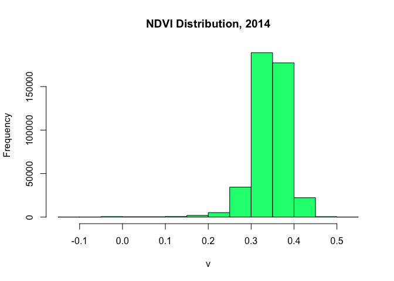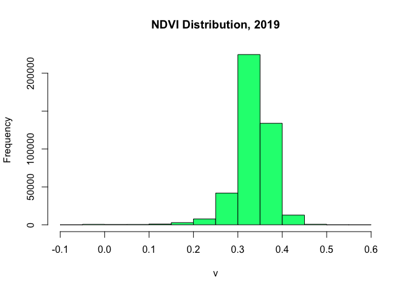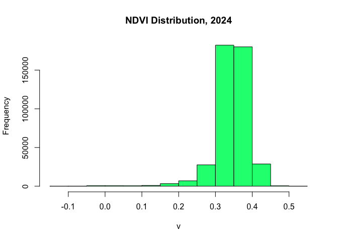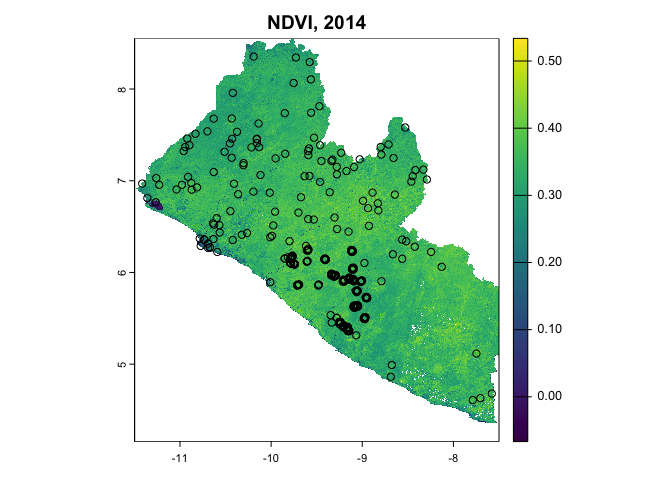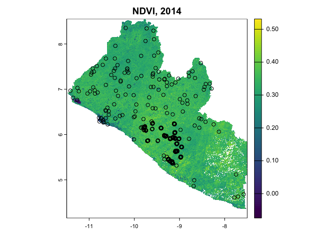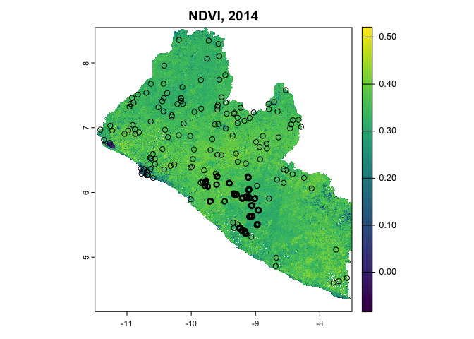

***Image classification***

We trained a Random Forest model fitted with 500 decision trees.
Training/test split partitioned the dataset using a 70:30 ratio.
Accuracy assessments were reported using a confusion matrix for full
model and cross-validation estimates. Uncertainty metrics were used to
select best subset of variables according to magnitude and performance.
Models were then calibrated in number regression trees and architecture
rules, with cross-validation reported to assess internal bias from true
population estimates before and to improve uncertainty of final model
deployment.

``` r
# extract yearly layers
STACK_2014=subset(STACK, c("NDVI_2014","BLUE_2014","GREEN_2014","NIR08_2014",
                           "RED_2014","SWIR16_2014","SWIR22_2014","DEM"))
# extract signatures
signatures_2014 = raster::extract(STACK_2014, samples ,df=T) # watch for data formats
samples_signatures_2014 <- dplyr::inner_join(signatures_2014, samples, by=c("ID"="id"))
samples_signatures_2014$geometry <- NULL # set geometry to NULL for model training

# training-test split, p=0.7 -> 70% split
trainIndex_2014 <- caret::createDataPartition(samples_signatures_2014$ID,list=F,p=0.7)
trainData_2014  <- samples_signatures_2014[trainIndex_2014,]  
testData_2014   <- samples_signatures_2014[-trainIndex_2014,] 

# interpolate NAs with class-median-normalization (NAs -> missing cloud pixels)
trainData_2014 <- trainData_2014 |> group_by(label) |> mutate(across(where(is.numeric),
    ~ ifelse(is.na(.), median(., na.rm = TRUE), .))) |> ungroup()
testData_2014 <- testData_2014 |> group_by(label) |> mutate(across(where(is.numeric),
    ~ ifelse(is.na(.), median(., na.rm = TRUE), .))) |> ungroup()

# assign model variables
response  <- c("label")
predictors_2014 <- c(
  "NDVI_2014", "BLUE_2014", "GREEN_2014", "RED_2014", 
  "NIR08_2014", "SWIR16_2014", "SWIR22_2014", "DEM"
  )
# set training parameters
cv_regime <- caret::trainControl(
  method          = 'cv',
  number          = 10,
  savePredictions = T,
  verboseIter     = F
  )

# train classifier
rf_model_2014 <- caret::train(
  label~.,
  data = trainData_2014[, c(predictors_2014, "label")], # drop ID var
  trControl = cv_regime,
  method    = "rf", 
  metric    = 'Kappa', 
  ntree     = 500,
  tuneLength= 6,
  importance= T
  )
```

*Accuracy assessments (note that randomForest metrics change each run)*

Results indicated that the model performed well during cross-validation,
achieving a Kappa value of 0.753 and an Accuracy of 94.44% at an optimal
mtry of 11.

In the blind data test, the model exhibited similar performance,
achieving a Kappa Index of 0.753 and an Accuracy of 94.44%. This was
accompanied by a No Information Rate (NIR) of 86.11%, indicating the
model’s significant predictive power (ACC = 0.9444, 95% CI \[0.883,
0.9793\], NIR = 0.8611).

While further investigation is warranted, these results suggest a
moderate concordance between observed and predicted classes. Notably,
key classes such as `Forest` and `Urban` were predicted with robust
Sensitivity and Specificity (e.g., Forest: SE = 0.9892, SP = 0.7333).

However, the absence of predictions for the `Farmbush` and `Water`
classes points to potential issues with class imbalance or insufficient
representation in the training data. To address these model weaknesses,
we may recommend experimenting with weighted Random Forest or
alternative algorithms such as Gradient Boosting or Support Vector
Machines (SVM) may improve performance for underrepresented classes. The
decision to explore additional modeling strategies is left to the
discretion of project leaders.

``` r
rf_test_2014 <- predict(rf_model_2014, testData_2014)
print(rf_model_2014) # cv results
```

    Random Forest 

    256 samples
      8 predictor
      5 classes: 'Farmbush', 'Forest', 'Regrowth', 'Urban', 'Water' 

    No pre-processing
    Resampling: Cross-Validated (10 fold) 
    Summary of sample sizes: 230, 232, 229, 232, 229, 229, ... 
    Resampling results across tuning parameters:

      mtry  Accuracy   Kappa    
      2     0.9384858  0.7484736
      3     0.9425100  0.7731017
      4     0.9425100  0.7731017
      5     0.9425100  0.7809018
      6     0.9425100  0.7809018
      8     0.9497393  0.7882299

    Kappa was used to select the optimal model using the largest value.
    The final value used for the model was mtry = 8.

``` r
caret::confusionMatrix(rf_test_2014,testData_2014$label) # blind test results
```

    Confusion Matrix and Statistics

              Reference
    Prediction Farmbush Forest Regrowth Urban Water
      Farmbush        0      0        0     0     0
      Forest          1     92        0     2     1
      Regrowth        0      1        1     0     0
      Urban           1      0        0     9     0
      Water           0      0        0     0     0

    Overall Statistics
                                             
                   Accuracy : 0.9444         
                     95% CI : (0.883, 0.9793)
        No Information Rate : 0.8611         
        P-Value [Acc > NIR] : 0.004895       
                                             
                      Kappa : 0.753          
                                             
     Mcnemar's Test P-Value : NA             

    Statistics by Class:

                         Class: Farmbush Class: Forest Class: Regrowth Class: Urban
    Sensitivity                  0.00000        0.9892        1.000000      0.81818
    Specificity                  1.00000        0.7333        0.990654      0.98969
    Pos Pred Value                   NaN        0.9583        0.500000      0.90000
    Neg Pred Value               0.98148        0.9167        1.000000      0.97959
    Prevalence                   0.01852        0.8611        0.009259      0.10185
    Detection Rate               0.00000        0.8519        0.009259      0.08333
    Detection Prevalence         0.00000        0.8889        0.018519      0.09259
    Balanced Accuracy            0.50000        0.8613        0.995327      0.90394
                         Class: Water
    Sensitivity              0.000000
    Specificity              1.000000
    Pos Pred Value                NaN
    Neg Pred Value           0.990741
    Prevalence               0.009259
    Detection Rate           0.000000
    Detection Prevalence     0.000000
    Balanced Accuracy        0.500000

*Model calibration*

We employed recursive predictor subsetting to identify predictors of
greatest magnitude and non-informative features to enhance model
performance and reduce model complexity, respectively. This aims to
limit potential of multicolinearity, despite inherent robustness of
randomForest algorithms against such violations. The subsetted model was
evaluated on the test dataset. The confusion matrix and performance
metrics were summarized below.

``` r
index_feature_2014 <- createMultiFolds(trainData_2014$label, times=5) 
predictor_seq_2014 <-seq(from=1, to=length(predictors_2014),by=2)

subset_regime_2014 <- rfeControl(
  method="cv",
  number = 10,
  verbose=FALSE,
  functions=rfFuncs,
  index=index_feature_2014
  )

rf_model_subset_2014 <- caret::rfe(
  label~.,
  data = trainData_2014[, c(predictors_2014, "label")], 
  sizes = predictor_seq_2014,
  metric = "Kappa",
  ntree=500,
  method="rf",
  rfeControl = subset_regime_2014
  )

rf_subset_test_2014 <- predict(rf_model_subset_2014,testData_2014)
print(rf_model_subset_2014)
```


    Recursive feature selection

    Outer resampling method: Cross-Validated (10 fold) 

    Resampling performance over subset size:

     Variables Accuracy  Kappa AccuracySD KappaSD Selected
             1   0.9057 0.6353    0.04318  0.1587         
             3   0.9509 0.7992    0.03979  0.1645        *
             5   0.9439 0.7701    0.04098  0.1764         
             7   0.9400 0.7469    0.04705  0.2084         
             8   0.9384 0.7471    0.04514  0.1890         

    The top 3 variables (out of 3):
       SWIR16_2014, SWIR22_2014, NDVI_2014

``` r
caret::confusionMatrix(rf_subset_test_2014$pred,testData_2014$label)
```

    Confusion Matrix and Statistics

              Reference
    Prediction Farmbush Forest Regrowth Urban Water
      Farmbush        0      0        0     0     0
      Forest          0     92        0     1     0
      Regrowth        0      1        1     0     0
      Urban           2      0        0    10     0
      Water           0      0        0     0     1

    Overall Statistics
                                              
                   Accuracy : 0.963           
                     95% CI : (0.9079, 0.9898)
        No Information Rate : 0.8611          
        P-Value [Acc > NIR] : 0.0004509       
                                              
                      Kappa : 0.85            
                                              
     Mcnemar's Test P-Value : NA              

    Statistics by Class:

                         Class: Farmbush Class: Forest Class: Regrowth Class: Urban
    Sensitivity                  0.00000        0.9892        1.000000      0.90909
    Specificity                  1.00000        0.9333        0.990654      0.97938
    Pos Pred Value                   NaN        0.9892        0.500000      0.83333
    Neg Pred Value               0.98148        0.9333        1.000000      0.98958
    Prevalence                   0.01852        0.8611        0.009259      0.10185
    Detection Rate               0.00000        0.8519        0.009259      0.09259
    Detection Prevalence         0.00000        0.8611        0.018519      0.11111
    Balanced Accuracy            0.50000        0.9613        0.995327      0.94424
                         Class: Water
    Sensitivity              1.000000
    Specificity              1.000000
    Pos Pred Value           1.000000
    Neg Pred Value           1.000000
    Prevalence               0.009259
    Detection Rate           0.009259
    Detection Prevalence     0.009259
    Balanced Accuracy        1.000000

In summary, the subset model achieved an Accuracy of 96.30% and a Kappa
Index of 0.8456. These metrics closely align with the results of the
original model, suggesting minimal or no loss in predictive power
despite using fewer predictors. Similarly, high-performing classes of
`Forest` and `Urban` maintained sensitivity and specificity. For
example, `TreeCover` had a Sensitivity of 0.9892 and Specificity of
0.8667, while `Urban` had a Sensitivity of 0.90909 and Specificity of
0.98969. Given that the reduction in complexity offered by the subsetted
model does not provide significant benefits in this context, we
recommend proceeding with the original model to make spatial
predictions.

These modelling operations were repeated for 2019 and 2024 (see Appendix
II).

Spatial predictions were made using their respective models and outputs
of classified LULC rasters were saved in the same Google Drive folder
linked above in previous sections.

``` r
# predict lulc rasters
LULC_LIBERIA_2014 <- raster::predict(STACK_2014,rf_model_2014) 
raster::writeRaster(LULC_LIBERIA_2014,"./data/LULC/LULC_LIBERIA_2014-01-04.tif",
  format = "GTiff",overwrite = T)
LULC_LIBERIA_2019 <- raster::predict(STACK_2019,rf_model_2019) 
raster::writeRaster(LULC_LIBERIA_2019,"./data/LULC/LULC_LIBERIA_2019-01-02.tif",
  format = "GTiff",overwrite = T)
LULC_LIBERIA_2024 <- raster::predict(STACK_2024,rf_model_2024) 
raster::writeRaster(LULC_LIBERIA_2024,"./data/LULC/LULC_LIBERIA_2024-01-16.tif",
  format = "GTiff",overwrite = T)

# visualise
LULC_LIBERIA_2014 = raster::raster("~/repos/rspb-redd-feasability/data/LULC/LULC_LIBERIA_2014-01-04.tif")
LULC_LIBERIA_2019 = raster::raster("~/repos/rspb-redd-feasability/data/LULC/LULC_LIBERIA_2019-01-02.tif")
LULC_LIBERIA_2024 = raster::raster("~/repos/rspb-redd-feasability/data/LULC/LULC_LIBERIA_2024-01-16.tif")
terra::plot(LULC_LIBERIA_2014, main="Land Cover Classification, 2014")
terra::plot(LULC_LIBERIA_2019, main="Land Cover Classification, 2019")
terra::plot(LULC_LIBERIA_2024, main="Land Cover Classification, 2024")
```

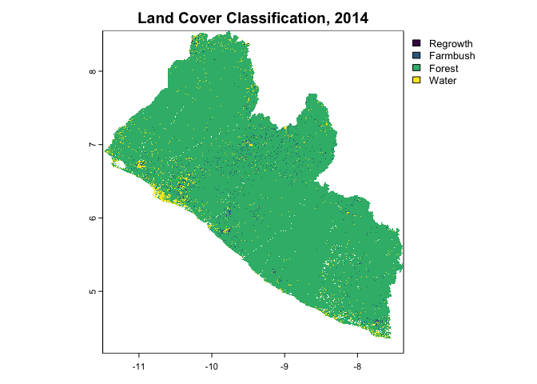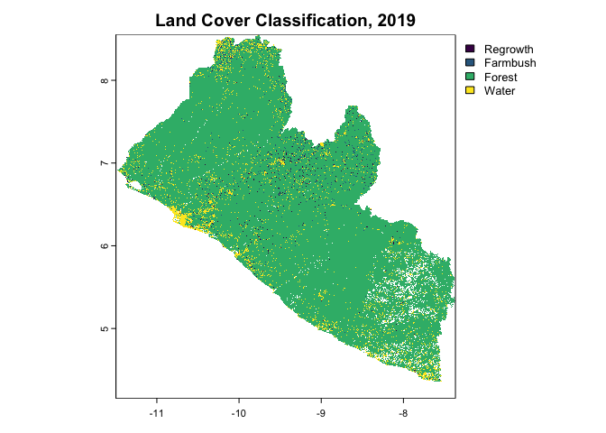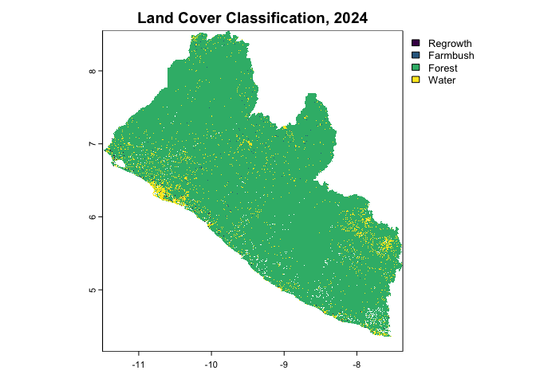

### Forest cover mapping

``` r
forest_class = 3
forest_2014 <- LULC_LIBERIA_2014 == forest_class
forest_2019 <- LULC_LIBERIA_2019 == forest_class
forest_2024 <- LULC_LIBERIA_2024 == forest_class
# Forest loss
forest_loss_2014_2019 <- forest_2014 & !forest_2019
forest_loss_2019_2024 <- forest_2019 & !forest_2024
forest_loss_2014_2024 <- forest_2014 & !forest_2024

terra::plot(forest_loss_2014_2019, main="Forest Loss 2014-2019")
terra::plot(forest_loss_2019_2024, main="Forest Loss 2019-2024")
terra::plot(forest_loss_2014_2024, main="Forest Loss 2014-2024")
terra::plot(forest_2014, main="Binary Forest Cover Map, 2014")
terra::plot(forest_2019, main="Binary Forest Cover Map, 2019")
terra::plot(forest_2024, main="Binary Forest Cover Map, 2024")

# Save the binary forest maps
raster::writeRaster(forest_2014, "~/repos/rspb-redd-feasability/data/LULC/forest_2014.tif",overwrite=T)
raster::writeRaster(forest_2019, "~/repos/rspb-redd-feasability/data/LULC/forest_2019.tif",overwrite=T)
raster::writeRaster(forest_2024, "~/repos/rspb-redd-feasability/data/LULC/forest_2024.tif",overwrite=T)
raster::writeRaster(forest_loss_2014_2019, "~/repos/rspb-redd-feasability/data/LULC/forest_loss_2014_2019.tif",overwrite=T)
raster::writeRaster(forest_loss_2019_2024, "~/repos/rspb-redd-feasability/data/LULC/forest_loss_2019_2024.tif",overwrite=T)
raster::writeRaster(forest_loss_2014_2024, "~/repos/rspb-redd-feasability/data/LULC/forest_loss_2014_2024.tif",overwrite=T)
```

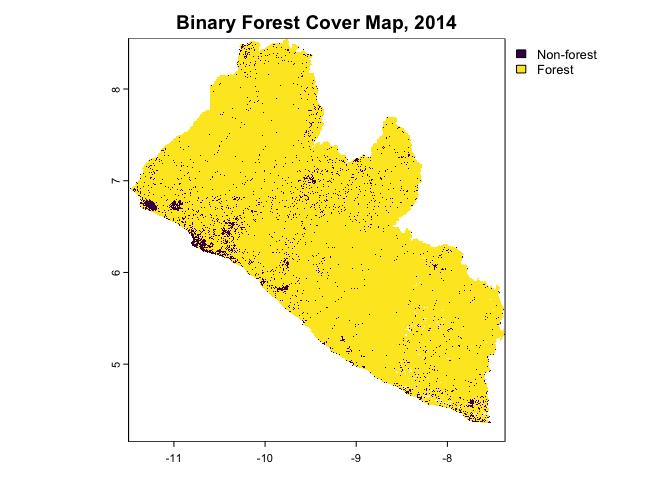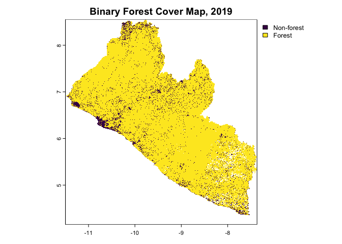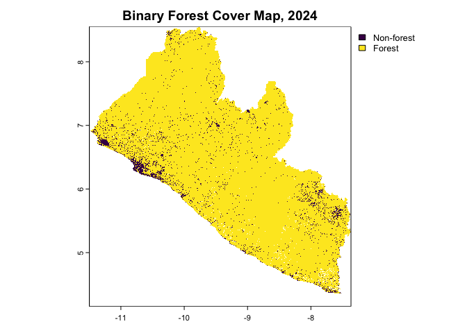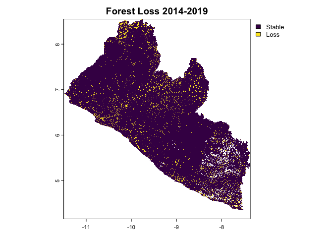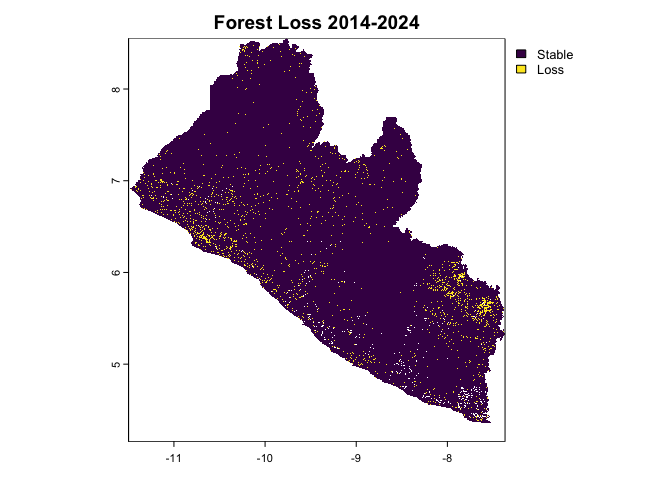
\### Forest loss mapping

    |---------|---------|---------|---------|=========================================                                          

    |---------|---------|---------|---------|=========================================                                          

    |---------|---------|---------|---------|=========================================                                          

    |---------|---------|---------|---------|=========================================                                          

    |---------|---------|---------|---------|=========================================                                          

    |---------|---------|---------|---------|=========================================                                          

    |---------|---------|---------|---------|=========================================                                          

    |---------|---------|---------|---------|=========================================                                          

    |---------|---------|---------|---------|=========================================                                          

    |---------|---------|---------|---------|=========================================                                          

``` r
# Calculate total number of forest pixels for each year
resolution <- res(forest_2014)[1]
forest_2014_estimate <- sum(forest_2014[], na.rm = TRUE) * resolution^2 / 10000
forest_2019_estimate <- sum(forest_2019[], na.rm = TRUE) * resolution^2 / 10000
forest_2024_estimate <- sum(forest_2024[], na.rm = TRUE) * resolution^2 / 10000
cat("Forest area in 2014:", forest_2014_estimate, "hectares\n")
```

    Forest area in 2014: 9146913 hectares

``` r
cat("Forest area in 2019:", forest_2019_estimate, "hectares\n")
```

    Forest area in 2019: 8675144 hectares

``` r
cat("Forest area in 2024:", forest_2024_estimate, "hectares\n")
```

    Forest area in 2024: 9112944 hectares

``` r
# Calculate forest area for each sub-region (in hectares) for all years
forest_2014_gola_estimate <- sum(forest_2014_gola[], na.rm = TRUE) * resolution^2 / 10000
forest_2014_tong_estimate <- sum(forest_2014_tong[], na.rm = TRUE) * resolution^2 / 10000
forest_2014_norm_estimate <- sum(forest_2014_norm[], na.rm = TRUE) * resolution^2 / 10000
forest_2014_project_estimate <- sum(forest_2014_project[], na.rm = TRUE) * resolution^2 / 10000
forest_2019_gola_estimate <- sum(forest_2019_gola[], na.rm = TRUE) * resolution^2 / 10000
forest_2019_tong_estimate <- sum(forest_2019_tong[], na.rm = TRUE) * resolution^2 / 10000
forest_2019_norm_estimate <- sum(forest_2019_norm[], na.rm = TRUE) * resolution^2 / 10000
forest_2019_project_estimate <- sum(forest_2019_project[], na.rm = TRUE) * resolution^2 / 10000
forest_2024_gola_estimate <- sum(forest_2024_gola[], na.rm = TRUE) * resolution^2 / 10000
forest_2024_tong_estimate <- sum(forest_2024_tong[], na.rm = TRUE) * resolution^2 / 10000
forest_2024_norm_estimate <- sum(forest_2024_norm[], na.rm = TRUE) * resolution^2 / 10000
forest_2024_project_estimate <- sum(forest_2024_project[], na.rm = TRUE) * resolution^2 / 10000

# Calculate forest loss for each sub-region (in hectares) for all periods
forest_loss_2014_2019_gola_estimate <- sum(forest_loss_2014_2019_gola[],na.rm=T)*resolution^2/10000
forest_loss_2014_2019_tong_estimate <- sum(forest_loss_2014_2019_tong[],na.rm=T)*resolution^2/10000
forest_loss_2014_2019_norm_estimate <- sum(forest_loss_2014_2019_norm[],na.rm=T)*resolution^2/10000
forest_loss_2014_2019_project_estimate <- sum(forest_loss_2014_2019_project[],na.rm=T)*resolution^2/10000
forest_loss_2019_2024_gola_estimate<- sum(forest_loss_2019_2024_gola[],na.rm=T)*resolution^2/10000
forest_loss_2019_2024_tong_estimate <- sum(forest_loss_2019_2024_tong[],na.rm=T)*resolution^2/10000
forest_loss_2019_2024_norm_estimate <- sum(forest_loss_2019_2024_norm[],na.rm=T)*resolution^2/10000
forest_loss_2019_2024_project_estimate <- sum(forest_loss_2019_2024_project[],na.rm=T)*resolution^2/10000
forest_loss_2014_2024_gola_estimate <- sum(forest_loss_2014_2024_gola[],na.rm=T)*resolution^2/10000
forest_loss_2014_2024_tong_estimate <- sum(forest_loss_2014_2024_tong[],na.rm=T)*resolution^2/10000
forest_loss_2014_2024_norm_estimate <- sum(forest_loss_2014_2024_norm[],na.rm=T)*resolution^2/10000
forest_loss_2014_2024_project_estimate <- sum(forest_loss_2014_2024_project[],na.rm=T)*resolution^2/10000

# Print out the forest area and loss estimates for each region and year
cat("Forest Area in Gola NP (2014):", forest_2014_gola_estimate, "hectares\n")
```

    Forest Area in Gola NP (2014): 88096.44 hectares

``` r
cat("Forest Area in Tonglay (2014):", forest_2014_norm_estimate, "hectares\n")
```

    Forest Area in Tonglay (2014): 6988.652 hectares

``` r
cat("Forest Area in Norman (2014):", forest_2014_tong_estimate, "hectares\n")
```

    Forest Area in Norman (2014): 29362.95 hectares

``` r
cat("Forest Area in Project (2014):", forest_2014_project_estimate, "hectares\n")
```

    Forest Area in Project (2014): 124316.7 hectares

``` r
cat("Forest Area in Gola NP (2019):", forest_2019_gola_estimate, "hectares\n")
```

    Forest Area in Gola NP (2019): 87869.96 hectares

``` r
cat("Forest Area in Tonglay (2019):", forest_2019_tong_estimate, "hectares\n")
```

    Forest Area in Tonglay (2019): 29152.85 hectares

``` r
cat("Forest Area in Norman (2019):", forest_2019_norm_estimate, "hectares\n")
```

    Forest Area in Norman (2019): 6963.308 hectares

``` r
cat("Forest Area in Project (2019):", forest_2019_project_estimate, "hectares\n")
```

    Forest Area in Project (2019): 123854.3 hectares

``` r
cat("Forest Area in Gola NP (2024):", forest_2024_gola_estimate, "hectares\n")
```

    Forest Area in Gola NP (2024): 88177.83 hectares

``` r
cat("Forest Area in Tonglay (2024):", forest_2024_tong_estimate, "hectares\n")
```

    Forest Area in Tonglay (2024): 29345.93 hectares

``` r
cat("Forest Area in Norman (2024):", forest_2024_norm_estimate, "hectares\n")
```

    Forest Area in Norman (2024): 6993.084 hectares

``` r
cat("Forest Area in Project (2024):", forest_2024_project_estimate, "hectares\n")
```

    Forest Area in Project (2024): 124388 hectares

``` r
cat("Forest Loss in Gola NP (2014-2019):", forest_loss_2014_2019_gola_estimate, "hectares\n")
```

    Forest Loss in Gola NP (2014-2019): 290.468 hectares

``` r
cat("Forest Loss in Tonglay (2014-2019):", forest_loss_2014_2019_tong_estimate, "hectares\n")
```

    Forest Loss in Tonglay (2014-2019): 235.4777 hectares

``` r
cat("Forest Loss in Norman (2014-2019):", forest_loss_2014_2019_norm_estimate, "hectares\n")
```

    Forest Loss in Norman (2014-2019): 30.12628 hectares

``` r
cat("Forest Loss in Project (2014-2019):", forest_loss_2014_2019_project_estimate, "hectares\n")
```

    Forest Loss in Project (2014-2019): 557.3676 hectares

``` r
cat("Forest Loss in Gola NP (2019-2024):", forest_loss_2019_2024_gola_estimate, "hectares\n")
```

    Forest Loss in Gola NP (2019-2024): 44.25972 hectares

``` r
cat("Forest Loss in Tonglay (2019-2024):", forest_loss_2019_2024_tong_estimate, "hectares\n")
```

    Forest Loss in Tonglay (2019-2024): 44.27696 hectares

``` r
cat("Forest Loss in Norman (2019-2024):", forest_loss_2019_2024_norm_estimate, "hectares\n")
```

    Forest Loss in Norman (2019-2024): 2.112028 hectares

``` r
cat("Forest Loss in Project (2019-2024):", forest_loss_2019_2024_project_estimate, "hectares\n")
```

    Forest Loss in Project (2019-2024): 91.06986 hectares

``` r
cat("Forest Loss in Gola NP (2014-2024):", forest_loss_2014_2024_gola_estimate, "hectares\n")
```

    Forest Loss in Gola NP (2014-2024): 54.93414 hectares

``` r
cat("Forest Loss in Tonglay (2014-2024):", forest_loss_2014_2024_tong_estimate, "hectares\n")
```

    Forest Loss in Tonglay (2014-2024): 60.44355 hectares

``` r
cat("Forest Loss in Norman (2014-2024):", forest_loss_2014_2024_norm_estimate, "hectares\n")
```

    Forest Loss in Norman (2014-2024): 4.31716 hectares

``` r
cat("Forest Loss in Project (2014-2024):", forest_loss_2014_2024_project_estimate, "hectares\n")
```

    Forest Loss in Project (2014-2024): 118.906 hectares

### Benchmarking & thresholding

In the following section, we calibrate NDVI thresholds to compare
outputs with unsupervised K-means clustering and the European Space
Agency’s Dynamic Global land cover dataset.

``` r
# thresholding
ndvi_float = ndvi_stack * 0.0001
ndvi_thresholds <- classify(
  ndvi_float, c(-1.0, 0.1, 0.4, 0.7, 1), 
  include.lowest=TRUE, 
  brackets=TRUE)
# kmeans clustering
ndvi_raster = raster::raster(ndvi_float)
nr = raster::getValues(ndvi_raster)
i <- !is.na(nr)
kmncluster <- kmeans(
  nr[i], 
  centers = 10, 
  iter.max = 500, 
  nstart = 5, 
  algorithm="Lloyd")
nr[i] <- kmncluster$cluster
kmeans <- setValues(ndvi_raster, nr)
writeRaster(kmeans, "./data/kmeans/NDVI_STACK_KMEANS.tif", overwrite=T)
writeRaster(ndvi_thresholds, "./data/thresholds/NDVI_STACK_THRESHOLDS.tif", overwrite=T)
```

### Appendix I: 2019 and 2024 classifiers

To run these, you may change eval=F to eval=T at the top of chunk in the
.Rmd or .R file saved in the OneDrive folder.

``` r
########################### 2019
# extract signatures
signatures_2019 = raster::extract(STACK_2019, samples ,df=T) # watch for data formats
samples_signatures_2019 <- dplyr::inner_join(signatures_2019, samples, by=c("ID"="id"))
samples_signatures_2019$geometry <- NULL # set geometry to NULL for model training

# training-test split, p=0.7 -> 70% split
trainIndex_2019 <- caret::createDataPartition(samples_signatures_2019$ID,list=F,p=0.7)
trainData_2019  <- samples_signatures_2019[trainIndex_2019,]  
testData_2019   <- samples_signatures_2019[-trainIndex_2019,] 

# interpolate NAs with class-median-normalization (NAs -> missing cloud pixels)
trainData_2019 <- trainData_2019 |> group_by(label) |> mutate(across(where(is.numeric),
    ~ ifelse(is.na(.), median(., na.rm = TRUE), .))) |> ungroup()
testData_2019 <- testData_2019 |> group_by(label) |> mutate(across(where(is.numeric),
    ~ ifelse(is.na(.), median(., na.rm = TRUE), .))) |> ungroup()

# assign model variables
response  <- c("label")
predictors_2019 <- c(
  "NDVI_2019", "BLUE_2019", "GREEN_2019", "RED_2019", 
  "NIR08_2019", "SWIR16_2019", "SWIR22_2019", "DEM"
  )

# train classifier
rf_model_2019 <- caret::train(
  label~.,
  data = trainData_2019[, c(predictors_2019, "label")], # drop ID var
  trControl = cv_regime,
  method    = "rf", 
  metric    = 'Kappa', 
  ntree     = 500,
  tuneLength= 6,
  importance= T
  )

rf_test_2019 <- predict(rf_model_2019, testData_2019)
print(rf_model_2019) # cv results
confusionMatrix(rf_test_2019,testData_2019$label) # blind test results

index_feature_2019 <- createMultiFolds(trainData_2019$label, times=5) 
predictor_seq_2019 <-seq(from=1, to=length(predictors_2019),by=2)

subset_regime_2019 <- rfeControl(
  method="cv",
  number = 10,
  verbose=FALSE,
  functions=rfFuncs,
  index=index_feature_2019
  )

rf_model_subset_2019 <- caret::rfe(
  label~.,
  data = trainData_2019[, c(predictors_2019, "label")], 
  sizes = predictor_seq_2019,
  metric = "Kappa",
  ntree=500,
  method="rf",
  rfeControl = subset_regime_2019
  )

rf_subset_test_2019 <- predict(rf_model_subset_2019,testData_2019)
print(rf_model_subset_2019)
confusionMatrix(rf_subset_test_2019$pred,testData_2019$label)

######################### 2024
# extract signatures
signatures_2024 = raster::extract(STACK_2024, samples ,df=T) # watch for data formats
samples_signatures_2024 <- dplyr::inner_join(signatures_2024, samples, by=c("ID"="id"))
samples_signatures_2024$geometry <- NULL # set geometry to NULL for model training

# training-test split, p=0.7 -> 70% split
trainIndex_2024 <- caret::createDataPartition(samples_signatures_2024$ID,list=F,p=0.7)
trainData_2024  <- samples_signatures_2024[trainIndex_2024,]  
testData_2024   <- samples_signatures_2024[-trainIndex_2024,] 

# interpolate NAs with class-median-normalization (NAs -> missing cloud pixels)
trainData_2024 <- trainData_2024 |> group_by(label) |> mutate(across(where(is.numeric),
    ~ ifelse(is.na(.), median(., na.rm = TRUE), .))) |> ungroup()
testData_2024 <- testData_2024 |> group_by(label) |> mutate(across(where(is.numeric),
    ~ ifelse(is.na(.), median(., na.rm = TRUE), .))) |> ungroup()
water_2014 <- trainData_2014[trainData_2014$label == "Water", ]
water_ids <- water_2014$ID
water_2024 <- samples_signatures_2024[samples_signatures_2024$ID %in% water_ids, ]
trainData_2024 <- rbind(trainData_2024, water_2024)
table(trainData_2024$label)

# assign model variables
response  <- c("label")
predictors_2024 <- c("NDVI_2024", "BLUE_2024", "GREEN_2024", "RED_2024", 
  "NIR08_2024", "SWIR16_2024", "SWIR22_2024", "DEM"
  )

# train classifier
rf_model_2024 <- caret::train(
  label~.,
  data = trainData_2024[, c(predictors_2024, "label")], # drop ID var
  trControl = cv_regime,
  method    = "rf", 
  metric    = 'Kappa', 
  ntree     = 500,
  tuneLength= 6,
  importance= T
  )

rf_test_2024 <- predict(rf_model_2024, testData_2024)
print(rf_model_2024) # cv results
confusionMatrix(rf_test_2024,testData_2024$label) # blind test results

index_feature_2024 <- createMultiFolds(trainData_2024$label, times=5) 
predictor_seq_2024 <-seq(from=1, to=length(predictors_2024),by=2)

subset_regime_2024 <- rfeControl(
  method="cv",
  number = 10,
  verbose=FALSE,
  functions=rfFuncs,
  index=index_feature_2024
  )

rf_model_subset_2024 <- caret::rfe(
  label~.,
  data = trainData_2024[, c(predictors_2024, "label")], 
  sizes = predictor_seq_2024,
  metric = "Kappa",
  ntree=500,
  method="rf",
  rfeControl = subset_regime_2024
  )

rf_subset_test_2024 <- predict(rf_model_subset_2024,testData_2024)
print(rf_model_subset_2024)
confusionMatrix(rf_subset_test_2024$pred,testData_2024$label)
```

<div id="refs" class="references csl-bib-body hanging-indent"
entry-spacing="0">

<div id="ref-governmentofliberiaLiberiasForestReference2019"
class="csl-entry">

Liberia, Government of. 2019. *Liberia’s Forest Reference Emission Level
Submission to the UNFCCC*. 1. Forestry Development Authority.

</div>

<div id="ref-stanimirovaGlobalLandCover2023" class="csl-entry">

Stanimirova, Radost, Katelyn Tarrio, Konrad Turlej, Kristina McAvoy,
Sophia Stonebrook, Kai-Ting Hu, Paulo Arévalo, et al. 2023. “A Global
Land Cover Training Dataset from 1984 to 2020.” *Scientific Data* 10
(1): 879. <https://doi.org/10.1038/s41597-023-02798-5>.

</div>

<div id="ref-verraVT0007UnplannedDeforestation2021" class="csl-entry">

Verra. 2021. *VT0007: Unplanned Deforestation Allocation Tool*. 0.1.
Verra.
<https://verra.org/wp-content/uploads/2024/02/VT0007-Unplanned-Deforestation-Allocation-v1.0.pdf>.

</div>

<div id="ref-verraVM0048ReducingEmissions2023a" class="csl-entry">

———. 2023. *VM0048: Reducing Emissions from Deforestation and Forest
Degradation*. 1.0. Verra.
<https://verra.org/wp-content/uploads/2023/11/VM0048-Reducing-Emissions-from-Deforestation-and-Forest-Degradation-v1.0-1-1.pdf>.

</div>

<div id="ref-verraVMD0055EstimationEmission2024" class="csl-entry">

———. 2024. *VMD0055: Estimation of Emission Reductions from Avoiding
Unplanned Deforestation*. VCS Module 1.1. Verra.
<https://verra.org/wp-content/uploads/2024/10/VMD0055-Estimation-of-Emission-Reductions-from-Avoiding-Unplanned-Deforestation-v1.1-CLEAN-2024.10.21.24.pdf>.

</div>

<div id="ref-woodcockGlobalLandCover" class="csl-entry">

Woodcock, Curtis, Pontus Olofsson, Thomas Loveland, Chris Barber, and
Zhe Zhu. n.d. “Global Land Cover Estimation (GLanCE) Product User Guide
Version 1.0 August 2022.”

</div>

</div>
